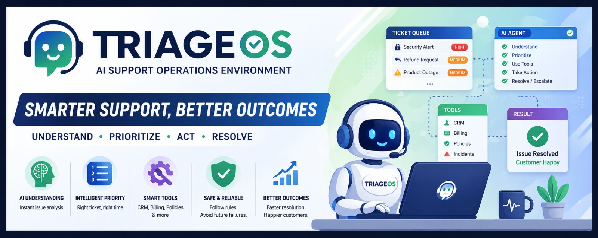
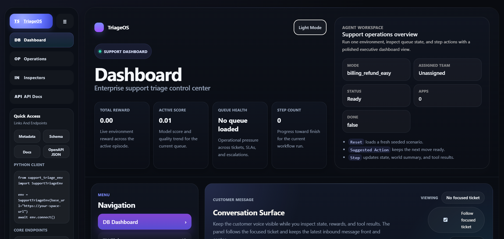

# TriageOS: World Modeling for Enterprise Support

  

  <strong>TriageOS is an OpenEnv-ready support operations environment where an AI agent must understand, prioritize, act, and resolve inside a realistic enterprise workflow.</strong>

  <em>Smarter support, better outcomes: built for world modeling, verifiable rewards, and real post-training with Unsloth + TRL.</em>

  
  
  
  

---

## At A Glance

<table>
  <tr>
    <td><strong>Problem</strong></td>
    <td>Enterprise support operations need more than polite text generation. Agents must inspect queue state, choose the right ticket, coordinate teams, and avoid unsafe shortcuts.</td>
  </tr>
  <tr>
    <td><strong>Environment</strong></td>
    <td>TriageOS simulates ticket routing, CRM actions, billing checks, escalations, follow-ups, and incident coordination with delayed downstream consequences.</td>
  </tr>
  <tr>
    <td><strong>Training Story</strong></td>
    <td>We completed strong supervised fine-tuning, RLVR-style verification experiments, and an actual GRPO post-training run on top of simulator reward.</td>
  </tr>
</table>

  
  
  

  <strong>Core loop:</strong> Understand the issue -> prioritize the right ticket -> use internal tools -> take the right action -> resolve safely.

  <em>This environment is designed to reward operational correctness, not just polished language.</em>

---

## Why TriageOS Exists

Most support benchmarks reward a reply that sounds convincing.
Real support systems need much more than that.

An effective triage agent has to:

- read a ticket correctly
- prioritize risk across a live queue
- route work to the right internal team
- use CRM, billing, policy, and incident tools correctly
- avoid unsafe shortcuts
- recover from delayed downstream failures

TriageOS is built around that exact gap between polished language and operational competence.

---

## What Makes The Environment Interesting

### 1. It Is Not Just A Chatbot Benchmark

The model is not rewarded for sounding helpful alone.
It must act inside a structured workflow:

- inspect queue state
- choose the right ticket
- classify correctly
- escalate with proper context
- coordinate incident handling
- resolve only when it is actually safe

### 2. It Models Delayed Consequences

Some decisions only reveal themselves later:

- a refund can reopen
- a weak escalation can be rejected
- a security issue can be under-prioritized
- a follow-up can reorder the queue

That makes the environment much closer to real professional operations.

### 3. It Supports Verifiable Reward

This project was built to be trainable with objective feedback:

- deterministic graders
- state-based success checks
- queue-aware penalties
- task-specific workflow requirements
- RLVR and GRPO experimentation on top of simulator reward

---

## Product Walkthrough

  

<strong>Main dashboard:</strong> where incoming tickets, priorities, and queue state become visible to the agent.

<table>
  <tr>
    <td align="center" width="50%">
      
       
      <strong>Action and control center</strong> 
      The agent routes, escalates, updates records, and communicates with customers here.
    </td>
    <td align="center" width="50%">
      
       
      <strong>System documentation</strong> 
      Structured docs make environment rules, reward logic, and architecture easy to inspect.
    </td>
  </tr>
</table>

  

<em>The environment combines ticket intelligence, tool use, policy grounding, and safe resolution into one operational loop.</em>

---

## Supervised Fine-Tuning Results

The strongest completed supervised fine-tuning run produced the best overall policy.

| Metric | Before | After | Delta |
| --- | --- | --- | --- |
| Classification accuracy | `0.2913` | `0.9990` | `+0.7077` |
| Environment mean score | `0.8201` | `0.9654` | `+0.1453` |
| Environment success rate | `0.55` | `1.00` | `+0.45` |
| Mean episode steps | `8.80` | `7.90` | `-0.90` |

### Highlights

- `executive_security_escalation`: `0.6051 -> 0.9900`
- `security_and_refund_hard`: `0.6583 -> 0.9900`
- `escalation_rejection_recovery`: `0.5900 -> 0.9200`
- `followup_reprioritization_queue`: `0.7745 -> 0.9343`

---

## Visual Proof Of Training

The saved evaluation reports capture the real before/after improvement story:

- classification accuracy improved from `0.2913` to `0.9990`
- environment mean score improved from `0.8201` to `0.9654`
- success rate improved from `0.55` to `1.00`

Additional plots and dashboards are linked from the notebook and README evidence section.

---

## RLVR And GRPO Experiments

We also built and ran reinforcement-learning-oriented stages on top of the environment:

- compact-prompt RLVR evaluation
- actual GRPO post-training with verifiable simulator reward

These experiments established two useful facts:

1. real RL-style post-training can be wired successfully against the simulator
2. broader multi-task performance is highly sensitive to reward shaping and task mixture

The best broad RLVR-style run reached strong task-level performance on incident coordination, and the GRPO run achieved a strong `0.99` result on escalation recovery, even though SFT remained the strongest overall policy.

---

## Why This Environment Matters

TriageOS combines:

- realistic professional workflows
- delayed consequences
- verifiable rewards
- strong SFT baselines
- trainable structure for RLVR and GRPO
- a clear demo story for judges

This is not just an assistant that replies nicely.
It is an agent benchmark for operating inside enterprise support systems with measurable business outcomes.

---

## Project Links

- Hugging Face Space: https://huggingface.co/spaces/Shubham-Godani/TriageOS_Support-triage-openenv
- GitHub Repository: https://github.com/appalla-karthik/Support_triage_env
- Training Notebook: https://github.com/appalla-karthik/Support_triage_env/blob/main/notebooks/triageos_training_colab.ipynb
- Open in Colab: https://colab.research.google.com/github/appalla-karthik/Support_triage_env/blob/main/notebooks/triageos_training_colab.ipynb
